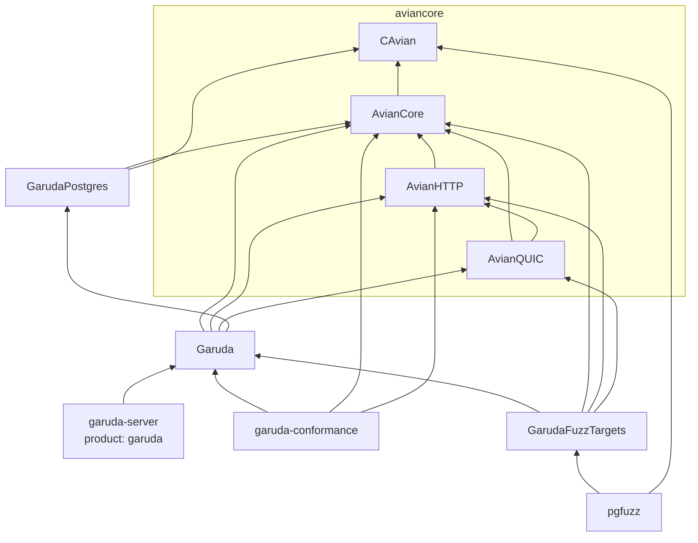
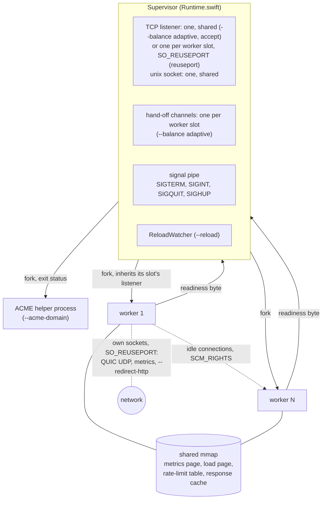
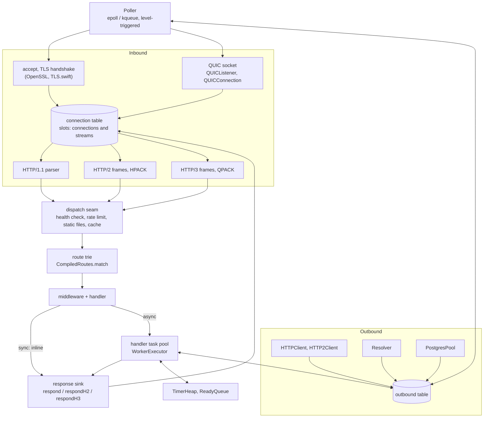
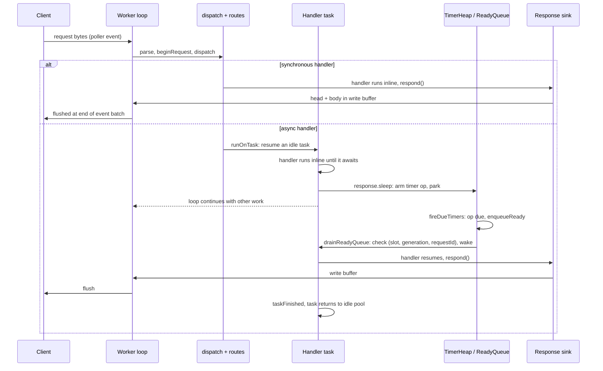

<p align="center">
  
</p>

# Architecture

Garuda is one Swift executable: the `Garuda` library plus the routes an
application registers. A supervisor process owns the listening sockets and
forks worker processes. Each worker is one thread running a readiness poller
over a flat table of connections. The worker parses HTTP/1.1, HTTP/2 and
HTTP/3 itself, runs handlers on that thread, and writes every answer through
one response sink. The binary links OpenSSL, zlib and the Swift runtime.
Foundation is not linked.

Protocol details are in [TRANSPORT.md](TRANSPORT.md), flags in
[CONFIG.md](CONFIG.md), the handler API in [HANDLER-API.md](HANDLER-API.md),
and project status in [README.md](README.md).

---

## Source tree

The protocol and systems layers come from
[aviancore](https://github.com/grepjava/aviancore), a separate package that
other Swift servers share. Garuda depends on it by version; its modules are the
first four rows below. Everything from `GarudaPostgres` down lives in this
repository.

| Target | What it holds |
| --- | --- |
| `CAvian` (aviancore) | C shim: epoll/kqueue, sockets, signals, fork, `sendfile`, TLS over TCP (`avian_tls.c`), crypto primitives for QUIC (`avian_crypto.c`), UDP with `recvmmsg` and GSO (`avian_udp.c`), ACME, compression, and the shared-memory tables for metrics, rate limiting and the response cache |
| `AvianCore` (aviancore) | `ByteBuffer`, `BufferPool`, `Poller`, logging, civil time |
| `AvianHTTP` (aviancore) | HTTP/1.1 parser, chunked decoder, response writer and parser, HPACK, QPACK, HTTP/2 and HTTP/3 framing, WebSocket framing, forwarded-header trust, cache policy |
| `AvianQUIC` (aviancore) | QUIC transport: packets, crypto, loss recovery, streams, the TLS 1.3 handshake |
| `GarudaPostgres` | PostgreSQL wire protocol, session state machines, SCRAM-SHA-256, binary values. No sockets. |
| `Garuda` | Supervisor, worker loop, connection table, HTTP/2 and HTTP/3 servers, dispatch, routes, middleware, response sink, handler tasks, timers, outbound connections, HTTP client, DNS resolver, PostgreSQL pool, streaming responses, WebTransport, static files, reload, ACME, metrics, CLI |
| `garuda-server` | The `garuda` executable: the benchmark routes, served through the handler API |
| `garuda-conformance` | Routes that make engine behaviour observable to the end-to-end suites |
| `GarudaFuzzTargets`, `pgfuzz` | Fuzz targets and their driver ([fuzz/README.md](fuzz/README.md)) |



Swift never imports an OpenSSL header. TLS sessions, contexts and keys are
opaque handles behind functions in the shim.

---

## Processes



### Supervisor

Everything runs under a supervisor, including a single worker
(`GarudaRuntime.runSupervisor`). Before the first fork it:

- opens the listening sockets. By default (`--balance adaptive`, and
  `accept`), TCP gets one socket that every worker accepts from. Under
  `--balance reuseport` it gets one socket per worker slot, each with
  `SO_REUSEPORT`, so each worker has its own accept queue. A unix socket is always one descriptor shared by every
  worker, because a path binds once;
- under `--balance adaptive`, makes one hand-off channel per worker slot
  ([Balancing connections](#balancing-connections));
- maps the shared pages (below);
- compiles the application's routes (`Application.compile`), so every worker
  inherits the same read-only table.

Workers are forked with `av_fork_worker`, which blocks the piped signals across
the fork so none is lost. A child closes every other slot's listener and every
other slot's receiving end of the hand-off channels. The supervisor keeps all
listeners and channels open for its whole life. The kernel assigns a
connection to a socket in the `SO_REUSEPORT` group when the SYN arrives, so a
socket that closed would take its queue with it. A replacement worker inherits
the same socket instead; with one shared socket the question does not arise.

Each worker opens its own QUIC UDP socket, metrics listener and
`--redirect-http` listener, also with `SO_REUSEPORT`.

After forking, a worker builds its poller, TLS context and listeners, runs the
`app.state` factories and `onWorkerStart` hooks, then writes one byte on its
readiness pipe. The supervisor reads the pipe: one byte means ready, end of
file means the worker died during start-up.

### Shared memory

Four tables are anonymous shared mappings created before the fork:

- **Metrics** (`avian_metrics.c`): two counter slots per worker, cache-line
  aligned. A replacement worker takes the other slot of its pair, so it never
  writes over the worker it replaces.
- **Load** (`avian_load.c`, unless `--balance reuseport`): one cache line per
  metrics slot, where each worker publishes how loaded it is. See below.
- **Rate limit** (`avian_ratelimit.c`, `--rate-limit`): GCRA per client
  address, atomic entries, open addressing with a per-server random seed.
- **Response cache** (`avian_cache.c`, `--cache-size`): size-classed slots with
  version words so readers never see a half-written entry. It is flushed on
  every reload. Handler responses are not stored in it yet.

Everything else is per worker: connections, buffers, timers, handler tasks,
outbound connections, the DNS cache, and anything built by `app.state`.

### Balancing connections

Workers share nothing while they serve, so nothing inside a worker knows
whether another has more than its share. `--balance` decides how connections
are spread (`Balancing.swift`):

| Mode | Where a new connection goes | Connections already placed |
|---|---|---|
| `adaptive` (default) | one shared listener; a worker ahead of the others steps back | quick ones move off a worker where they would wait; slow ones are gathered so that some workers stay free of them |
| `accept` | as `adaptive` | stay where they landed |
| `reuseport` | a listener per worker with `SO_REUSEPORT`; the kernel hashes the connection's addresses | stay where they landed |

**Why it matters.** The kernel's hash ignores load. In one benchmark run, 64
keep-alive connections on 8 workers landed 3 on one worker and 13 on another.
Worse, it ignores cost: a worker that happens to hold a connection making
two-millisecond requests keeps every quick request on it waiting behind them.
On macOS `SO_REUSEPORT` gives every connection to one socket.

On the bench box, with 4 workers, 62 connections asking for a path parameter
and 2 asking for a route that holds the CPU for 2 ms, the quick requests'
p99 was:

| | slow requests from the start (`skew`) | slow requests from a second in (`spike`) |
|---|---|---|
| `reuseport` | 2.8–3.5 ms | 2.9–3.7 ms |
| `accept` | 0.6–1.3 ms | 3.0–3.6 ms |
| `adaptive` | 0.9–1.2 ms | 0.9–1.1 ms |
| axum | 1.1–1.2 ms | 1.1–1.2 ms |

With 8 workers, and 8 slow connections among 64 -- one for every worker --
the quick requests fared as follows, over two runs each:

| | `skew` req/s | `skew` p99 | `spike` req/s | `spike` p99 |
|---|---:|---:|---:|---:|
| `reuseport` | 21,000–43,000 | 6.3–7.3 ms | 70,000–79,000 | 6.6–7.6 ms |
| `accept` | 87,000–91,000 | 3.9–4.2 ms | 104,000–109,000 | 3.6–3.9 ms |
| `adaptive` | 70,000–71,000 | 3.3–3.4 ms | 121,000–130,000 | 2.4–2.8 ms |
| axum | 49,000–50,000 | 3.2–3.6 ms | 64,000 | 3.0–3.1 ms |

Before slow connections were gathered (below), `adaptive` managed 20,000–
24,000 requests a second on `skew` at a p99 of 6.4–7.0 ms.

On uniform load the three modes measure about the same, except that the
shared listener takes 0.5 to 1.5 ms off the p99 of small requests and 2 ms
off HTTP/2's. BENCHMARKS.md has the runs.

#### The load page

`avian_load.c` maps one cache line per metrics slot before the first fork,
which is two per worker slot so a replacement never shares a line with the
worker it replaces. Each worker writes only its own line:

- **busy**: the share of its time the loop spent working rather than waiting
  in `epoll_wait`, in thousandths, measured over 10 ms windows and smoothed,
  each window weighing a quarter;
- **connections**: how many it holds, written whenever that changes;
- **accepting**: whether it is watching the shared listener right now;
- **wait**: how long a request arriving now would wait (below);
- **heavy**: how many of its connections are heavy (below);
- **waiting since**: set while it waits. An idle loop does not turn, so it
  cannot refresh its reading; a reader discounts a waiting worker's busy
  reading to nothing over 20 ms instead.

A worker pays two clock reads and a few relaxed stores to its own line per
loop turn and per connection. It reads the others' lines once per accept pass
and once every 2 ms in its balance tick.

#### Placement: one shared listener

The supervisor opens one TCP socket, and every worker watches it. Every idle
worker is woken for a new connection, and a busy one sees it on its next turn.
Each takes the connection it was woken for, if it is still there. Before each
further accept in the same pass, it reads the load page and steps back if it
is **ahead** (`BalancePolicy.standing`) of a worker that is accepting:

- **busier**: at least 500 busy and 250 busier than the least busy; or
- **more connections**: more than the fewest by max(3, an eighth), counted
  only against workers about as free as itself. A worker holding fewer
  because it is flat out with them is no yardstick.

Stepping back removes the listener from its poller. The worker takes it back
the moment it is no longer ahead, checked every loop turn with the loop
waiting at most 1 ms at a time, and after 50 ms whatever the readings say.

Two details keep a queued connection from waiting on nobody:

- Only accepting workers are compared against. Otherwise workers could each
  defer to another that had just stepped back itself, and leave connections
  queued with all of them idle. A worker with nobody accepting to defer to
  takes everything.
- The listener is not registered with `EPOLLEXCLUSIVE`. An exclusive wake-up
  tells a waiting connection to one worker only, and if that one then stepped
  back, the rest of the queue would wait for the next arrival to wake someone
  else. It is used only where nobody steps back: a unix socket under
  `reuseport`, or a single worker.

kqueue wakes every worker the same way, so macOS behaves as Linux does.

#### Moving idle connections

Placement cannot fix connections already placed, and cannot know which
connections will turn out to be slow. Under `adaptive`, a worker moves idle
connections to another worker where they would wait less.

**The wait.** A worker serves in turns: it collects what is ready, works
through all of it, and waits again. A request that arrives mid-turn waits for
the rest of that turn. So the expected wait is the share of time spent working
times the mean remaining length of a turn:

    wait = busy · E[T²] / (2 · E[T])

where T is how long each turn worked. The second moment is what matters. It
is long where one request takes milliseconds, and long where many quick
requests arrive together, and two workers equally busy differ by exactly
that. Half busy with 2 ms requests reads 500 µs; flat out with turns of 44
quick requests at 15 µs each reads 330 µs.

**When.** A worker with a wait of at least 100 µs that has stayed more than
twice that of another worker, plus 100 µs, for 100 ms sends it a quarter of
its connections, at most 8, then waits 100 ms for the readings to catch up
(`BalancePolicy.moveTarget`).

**Which.** HTTP/1 connections between requests that have served at least one:
nothing buffered or waiting to be written, no file or body in flight, no
handler parked, not WebSocket, HTTP/2 or half-closed, and either plaintext or
TLS the kernel carries both ways (below). Cheapest first, by each
connection's smoothed time from dispatch to answer. Neither a heavy connection
nor the costliest one goes: moving those would move the load rather than share
it, while moving the cheap ones out from behind them is what shortens their
wait.

**How.** The supervisor makes one datagram unix socket pair per worker slot
before the fork. The sending worker removes the socket from its poller, sends
the descriptor with `SCM_RIGHTS` together with a note (the peer's address and
port, the requests served, whether TLS is the kernel's), and closes its own
copy. The receiving worker adopts it as it would an accepted connection. A
request the client sends meanwhile waits in the socket and is read by the new
worker. A connection that moved stays put for a second. A connection the
channel cannot take right now stays where it is.

For example, 4 workers hold 16 quick connections each when two clients start
calling a route that takes 2 ms. Their two workers' waits climb to around a
millisecond while the others stay near 100 µs. After 100 ms each of the two
sends 4 of its quick connections to the worker with the shortest wait, and
again every 100 ms, until only the slow connections are left or the waits
are within the margins.

#### Gathering slow connections

Moving quick connections needs a worker with a short wait to move them to.
When slow connections arrive first, onto idle workers, placement spreads them
evenly, and with as many slow connections as workers each worker gets one.
Every quick request then waits behind a slow one wherever it goes, and there
is nowhere better to move it. That is the case where Tokio's work stealing did
better than moving connections: 20,000 quick requests a second against axum's
49,000.

So slow connections are gathered onto fewer workers, freeing the others for
the quick ones (`BalancePolicy.gatherTarget`).

- **Heavy.** Each connection keeps a smoothed reading of how long its requests
  hold the loop, from dispatch until the loop gets back, each request weighing
  an eighth (`holdUs`). Past 500 µs the connection is heavy. The second request
  of 3 ms makes it so; one slow request among quick ones does not. A request
  answered by an async handler holds the loop only until the handler starts,
  so waiting on a database never makes a connection heavy. Each worker
  publishes its count.
- **When.** Quick requests are waiting (some worker holds connections that are
  not heavy, with a wait of at least 100 µs), and no worker without heavy
  connections has a wait under 100 µs. If one did, the ordinary moves above
  would send the quick connections there.
- **Who, and where to.** The worker holding the fewest heavy connections gives
  -- the highest slot among equals -- to the one holding the most, the lowest
  slot among equals. Every worker reading the same page picks the same pair,
  and a heavy connection only ever moves toward a worker with more of them, so
  it never comes back. It keeps the same 100 ms sustain and cooldown as other
  moves.
- **How far.** Slow requests always keep at least half the workers. Beyond
  that they would pay more than the quick ones gain.
- **Back again.** When a worker holds two or more gathered connections and two
  workers without any sit idle (under 250 busy), it hands one back to the
  idler of them, so slow requests get the CPU again once the quick load has
  gone (`BalancePolicy.spreadTarget`).

For example, 8 slow connections land one per worker, then 56 quick ones
arrive. Worker 7 gives its slow connection to worker 0, and the ordinary moves
send quick connections to worker 7. While worker 7 is flat out with them (its
wait over 100 µs), worker 6 gives its slow one to worker 0 as well, and so on
until the quick ones have enough room or four workers are free. The slow
requests then share four workers instead of eight.

**TLS.** An OpenSSL session lives in the memory of the process that did the
handshake, so it cannot move with the descriptor. A TLS connection moves only
when the kernel encrypts and decrypts it both ways (`--ktls`, [kernel
TLS](TRANSPORT.md#kernel-tls)). The worker then frees its OpenSSL session
without a word on the wire (`av_tls_release_to_kernel`), and the next worker
reads and writes the socket as plaintext while the kernel does TLS.

**What never moves:** a request in progress, HTTP/2 connections (their HPACK
tables and streams are the worker's), WebSocket and other streams, and
HTTP/3, whose packets arrive on each worker's own UDP socket.

#### Why processes rather than threads

Tokio, the runtime behind axum, balances by moving tasks between threads of
one process. An idle thread takes ready tasks from a busy one's queue, at any
`await`, so it rebalances TLS and HTTP/2 connections and requests in flight.
Garuda's workers are processes instead, for two reasons:

- **A trap ends a process.** A force-unwrapped `nil`, an index out of range,
  integer overflow or a failed `precondition` stops a Swift process at once:
  nothing unwinds and nothing can catch it. In Rust the same bugs are panics,
  which unwind, and Tokio contains one to the task that raised it. In
  Garuda a trap ends one worker and the connections it held; the supervisor
  starts a replacement on the same listener, and the other workers never
  notice. Threads would lose every connection on every thread.
- **Nothing is shared on a request's path**: no locks, no atomics, no
  cross-thread wake-ups. That is where Garuda's median latency comes from.

Moving an HTTP/1 connection between requests is about the granularity at
which Tokio moves an HTTP/1 connection's task. What processes give up is
moving TLS without kernel TLS, HTTP/2, and requests in flight.

#### Restarts

Under `accept` and `adaptive` the one listener belongs to the supervisor for
its whole life, so a queued connection is never lost when a worker is
replaced. A draining worker removes the listener from its poller, marks its
load slot draining so that nobody hands it anything more, and stops reading
its channel. Anything already sent waits in the channel, which belongs to the
slot, for the replacement. The supervisor clears the load slot of every worker
it reaps, since a worker that crashed cleared nothing itself.

After a `--reload` exec, the new supervisor maps a new load page and makes new
channels. Workers adopted from the previous image hand connections only to
each other until they are replaced.

### Reload and signals

A worker that exits on its own is restarted in its slot. `SIGHUP` replaces the
workers one slot at a time:

1. fork the replacement and move the slot to the other metrics slot;
2. wait for its readiness byte, bounded at 60 s. Both workers serve the slot
   meanwhile;
3. send the old worker `SIGQUIT`;
4. when it exits, move to the next slot.

If a replacement dies before it is ready, the slot returns to the old worker
and the pass stops. A reload requested during a pass queues another pass.

`--reload` watches the executable (`ReloadWatcher.swift`) with inotify or
kqueue, and also re-stats it every `--reload-interval`. A change counts once
the file has held still for 300 ms. Forked workers cannot run new code, so the
supervisor re-executes itself (`Reexec.swift`): it waits until no pass,
handover or ACME helper is in flight, checks that the new file runs, and
`exec`s it with the listener descriptors and worker pids in `GARUDA_REEXEC`.
The new image adopts the workers and replaces them as `SIGHUP` would. A change
to a TLS certificate or key starts a replacement pass without an exec.

`--acme-domain` runs the ACME client in a forked helper process, one at a time.
Exit 0 means a new certificate is on disk and starts a replacement pass.
Failures back off from one minute, doubling up to six hours.

Shutdown:

- `SIGTERM`: forwarded to workers. With `--drain-delay`, a worker keeps serving
  but fails `--health-check-path` with 503, then drains.
- `SIGINT`, `SIGQUIT`: drain now. A second one cuts a drain delay short.
- Draining closes keep-alive connections idle between requests (not freshly
  accepted ones that may already hold a request), stops polling and closes the
  listener, leaves the load page and its hand-off channel, and ends the loop
  once the connection table is empty.
- `--graceful-timeout` bounds in-flight requests. A `SIGALRM` watchdog
  `_exit`s the worker 10 s after that, and the supervisor `SIGKILL`s any worker
  alive past drain delay + grace period + 2 s.

---

## Inside a worker



### The loop

A worker is one `Worker` struct reached through a raw pointer, held in a C
thread-local. `runSynchronousLoop` is:

```swift
while running {
    let n = poller.wait(timeoutMillis: quicPollTimeout(200))   // at most 32 events
    if n > 0 { processEvents(n) }   // then flush the batch's HTTP/1 responses
    fireDueTimers()                 // TimerHeap -> ReadyQueue
    drainReadyQueue()               // at most 64 resumes
    runHandlerTasks()               // drain the task executor
    quicTick()                      // QUIC timers, at most every 4 ms
    sweepTimeouts()                 // once a second
    if draining && quiescent { running = false }
}
```

The poll timeout is 200 ms, cut to the nearest QUIC or timer deadline (rounded
up), and 0 while the ready queue holds work.

**Short turns.** A turn takes at most 32 events (`Worker.eventsPerTurn`); the
rest stay ready and are taken on the next turn, straight away. A turn answers
everything it took before it waits again, so a request that arrives mid-turn
waits for the rest of it. With 64 busy connections on one worker and no cap, a
turn took all 64, and a request that just missed one waited for most of two:
the p99 of small requests was twice their median. Capped at 32, it went from
1.0 ms to 0.65 at the same throughput. Tokio does the same kind of thing: a
worker thread checks for new I/O every 61 tasks.

**Short time slices.** Each worker asks the kernel for a 300 µs scheduler
slice (`--sched-slice`; EEVDF's custom slice, Linux 6.12 and later). A worker
owns its connections, so when another thread takes its CPU, every one of them
waits until the worker gets it back -- up to a whole slice, 2.8 ms by default
on an 8-CPU machine. A Tokio thread that loses its CPU leaves its work to the
other threads. With the load generator sharing the 8 CPUs, the kernel took the
CPU from Garuda's workers 3,200 to 3,600 times a second, against 700 to 800
for axum's threads, and the p99 of JSON and JWT requests sat at the default
slice, about 3 ms. With 300 µs slices it came down to 1.7 to 2.1 ms, level with
axum, at the same throughput. Where the machine is not oversubscribed the
slice changes nothing: a worker that is not preempted never reaches its end.

### Connection slots and identity

Connections live in one contiguous slab of `Connection` structs with a free
list (`Connection.swift`). A poller token is `(generation << 24) | slot`.
`allocate` bumps the slot's generation, so an event for a descriptor closed
earlier in the same batch is discarded with one compare. Fixed tokens at the
top of the range name the listener, signal pipe, QUIC socket, metrics and
redirect listeners, and eight pending scrapes. Outbound connections set bit 62.

A slot is a connection or a stream. Each HTTP/2 and HTTP/3 request stream takes
a slot from the same table with `fd = -1` and `parentSlot` pointing at its
connection. An HTTP/3 connection's own slot has no descriptor either. Dispatch,
timers and cancellation treat all of them alike.

A request is identified by `(slot, generation, requestId)`. The generation
changes when the slot is allocated. `requestId` changes at every request on the
slot, so a keep-alive connection's second request is distinct from its first.
Timers, queued resumes, handler tasks and `Response` values all carry this
triple and check it before acting.

States: `readingHead → readingBody → dispatching → writing`, then back to
`readingHead` or closed. Long-lived states are `http2` and `http3`, plus
`closing` for a stream whose response finished before its upload did. A full
table answers 503 and closes. Accepts are bounded at 64 per wake-up, and
`EMFILE` pauses accepting until a slot frees.

### A request, from bytes to response

1. **Read.** `fill` drains the socket into a pooled read buffer. Over TLS it
   keeps reading while OpenSSL holds decrypted bytes the poller cannot see.
2. **Parse.** `HTTPParser.parse` yields offsets into the read buffer and
   allocates nothing. HTTP/2 and HTTP/3 rebuild the head as HTTP/1.1 text in
   the stream slot and run the same parser.
3. **Begin.** `beginRequest` bumps `requestId`, cancels anything left from the
   previous request, decides keep-alive, answers 413 for an oversized
   `Content-Length`, sends `100 Continue` if asked, and sets up body framing.
4. **Body.** The whole body is buffered before dispatch, on every protocol.
   An HTTP/1.1 body is never read past its declared end.
5. **Dispatch** (`Worker.dispatch`): request ID and trace context, then in
   order `--no-websockets` (501 for an upgrade), `--health-check-path`,
   `--rate-limit` (429), `--static-dir`, `--compress` negotiation,
   `--cache-size`, a refusal of any extended CONNECT that is not WebTransport,
   and finally `dispatchRoute`.
6. **Route.** `CompiledRoutes.match` walks a flat byte trie built from the
   patterns: literal before `:param` before trailing `*rest`, with
   backtracking, at most 8 parameters stored as offsets. No match is 404; a
   path another method would match is 405 with `Allow`. A route's deadline, if
   any, is armed here.
7. **Handler.** `runHandler` calls the handler with `Request` and `Response`,
   `~Copyable` views of the slot. Middleware was composed into each route's
   handler at compile time: synchronous middleware up to the first async one
   runs inline, and the rest of the chain and the handler run on a task.
   Typed handlers take extractors (`Path`, `Query`, `Body`, `Form`, `State`
   and others) and return a `ResponseConvertible`.
8. **Sink.** `respond` (`Respond.swift`) runs any `onSend` hooks, then writes
   status, `Date`, `Server`, server headers (Alt-Svc, HSTS, X-Request-ID)
   unless the handler set them, the handler's headers, framing and body. A body
   longer than a declared `Content-Length` is cut to it; a shorter one closes
   the HTTP/1.1 connection or resets the stream. On streams it encodes with
   HPACK or QPACK instead (`respondH2`, `respondH3`).
9. **Write.** A finished HTTP/1 response waits in its write buffer until the
   end of the event batch, or until 16 are queued, and they go out together.
   `finishResponse` then returns the slot to `readingHead` and processes any
   pipelined bytes, or closes it.

A handler that throws gets 500, or the status of a `ResponseError`. One that
returns without answering or waiting gets 500.



### Handler tasks

An async handler does not get a `Task` per request (`HandlerTasks.swift`).
Each worker owns a `WorkerExecutor`, a `TaskExecutor` whose jobs run only on
the worker's thread when the loop drains it, and a pool of long-lived tasks
that prefer it. A request resumes an idle task, which runs the handler inline
in the same loop turn until it answers or awaits. When all tasks are busy a new
one is started, up to 1,024 or the connection capacity, whichever is lower.
Past that the request waits in the pool's queue. The pool is created on the
first async request. `HandlerTaskTests` checks that a warm async request
allocates nothing on glibc.

To the rest of the engine, a request on a task is a continuation of kind
`.task`. Waits on the engine (`Response.sleep`, a streamed body's write) park
the task with an `UnsafeContinuation` and resume it through the ready queue or
the executor, never inline from the code that made room.

### Timers and continuations

`AsyncOps.swift` holds three fixed-capacity structures, sized to the
connection table:

- **`AsyncOpPool`**: op records with a free list. Each stores slot,
  `requestId`, kind (`timer`, `deadline`, `outbound`, `timedWait`), a
  microsecond deadline and its heap index. Allocation bumps a generation.
- **`TimerHeap`**: a min-heap of `(deadlineUs, opIndex, opGeneration)`. Ops can
  be removed from the middle. Deadlines use the monotonic microsecond clock
  plus one, so a timer never fires early.
- **`ReadyQueue`**: a ring buffer of `(slot, generation, requestId, ticket)`.
  The ticket is a per-worker serial stamped on the connection when it becomes
  ready, so only the newest entry can resume it. Stale entries are skipped at
  drain time, and a full queue is compacted in place.

A connection holds at most one continuation op (`contOp`) and one route
deadline op (`deadlineOp`). A synchronous handler can wait with
`Response.after(milliseconds:then:)`, which parks a handler closure on the
slot.

A route deadline (`app.deadline`) fires as a separate op. It answers 504, marks
the request `.timedOut` so later sends from the handler are dropped, and
cancels the task. It bounds waiting, not computing: nothing preempts a handler
that loops without awaiting.

### Cancellation

`cancelOps` frees the op named by `contOp`, unlinks it from the heap, drops a
parked handler closure, cancels the request's task (or its place in the task
queue), and ends a streamed-body writer's wait. It runs at every request start,
on keep-alive completion, and from `closeConnection`. An HTTP/2 `RST_STREAM`,
an HTTP/3 `RESET_STREAM` or `STOP_SENDING`, and a parent connection closing
all reach `closeConnection`. A cancelled task's wait throws
`HandlerWaitError.cancelled`, the handler unwinds, and the task returns to the
pool.

A handler waiting on something other than the engine, such as an outbound
socket, is not unwound when its request ends. Those waits have their own
timeouts. When it resumes, every `Response` operation checks
`(slot, generation, requestId)` and drops an answer for a request that is gone.
`response.isCancelled` lets a handler check for itself.

`response.cancellable { … }` (Cancellation.swift) is how such a wait is given
up on rather than merely noticed. The handler task cannot be cancelled --
tasks are pooled and reused, and a task cancelled in Swift's sense stays
cancelled -- so the body runs in an unstructured task of its own, on the same
worker executor, and the handler races it against a waiter registered on the
connection slot. Every path that ends a request wakes those waiters:
`cancelOps` covers a closed connection, a reset stream and the next request on
a keep-alive, and `deadlineFired` covers the deadline, which does not go
through `cancelOps` while a task holds the slot.

The body is cancelled when the handler gives up, and a body that pays no
attention to cancellation keeps running on the worker's thread. What it gives
back is the handler task and nothing else, so the worker counts those
(`Worker.abandonedWaits`), logs once on the way past
`ServerConfig.maxAbandonedWaits`, and answers the health check 503 until it
has caught up -- out of rotation rather than failing requests that have
nothing to do with what is stuck.

### Outbound I/O

Connections a worker makes (`Outbound.swift`) are registered on the same
poller and served on the same thread. They live in their own slab (256 per
worker), not the connection table, so an idle pooled connection does not stop
a draining worker from looking quiescent. They are closed when the worker
tears down. Idle connections are pooled per destination (8 per key, 30 s) and
watched for readability, so a peer hang-up is noticed before reuse. A connect
is bounded by an `outbound` timer op. A socket has one waiter, parked as a
continuation and resumed from the poller event.

Built on it:

- **HTTP client** (`HTTPClient.swift`, `HTTP2Client.swift`): HTTP/1.1 and
  HTTP/2, chosen by ALPN. HTTP/2 connections are shared by every request to the
  same place; the request waiting for data holds a read baton. Redirects are
  not followed. Pooled TLS connections are keyed by host name, trust store and
  ALPN offer.
- **DNS** (`Resolver.swift`): a stub resolver over UDP on the poller, using
  `/etc/resolv.conf` read once at start-up, retrying over TCP when an answer is
  truncated. `getaddrinfo` is never called. Answers, including negative ones,
  are cached per worker.
- **PostgreSQL** (`Postgres.swift`, `PostgresPool.swift`, `GarudaPostgres`):
  a pool per worker, built by `app.state` after the fork. TLS required by
  default, SCRAM-SHA-256, parameters bound separately from SQL, a per-connection
  prepared-statement cache, binary results for common types on repeated
  statements, and transactions. `TimedWait.swift` bounds a wait for a pooled
  connection.

---

## Keeping allocation off the request path

- Connections are slab entries reached by pointer, not objects.
- `ByteBuffer` is a pointer and three integers with an explicit `destroy()`.
  Read buffers come from a LIFO `BufferPool`.
- The parser yields offsets. Routes match bytes. Header values, parameters and
  the body reach a handler as byte spans unless it asks for a `String`.
- Request headers live in one worker-wide table. A request whose table was
  overwritten by another request's parse has its head parsed again from bytes
  that stay in place, never copied.
- `setInterest` skips `epoll_ctl` when the mask is unchanged.
- `accept4`, `TCP_NODELAY`, `sendfile` for static files (`SSL_sendfile` under
  kernel TLS), `recvmmsg` and UDP GSO for QUIC.

Classes are used where the cost is per process or per connection:
`H2Connection`, `H3Connection`, `QUICConnection`, `QUICListener`, the handler
task pool, the supervisor's state.

## Limits

- `--max-header-size`, a header count limit, and `--max-body` counted
  cumulatively on every protocol. `--max-connections` per worker.
- A write buffer that grew past four read-buffer sizes is freed once drained.
- A stream moves bytes to its connection only while the connection's write
  buffer is under the write high-water mark (512 KiB). A streamed response
  waits above that mark and resumes at the low-water mark (128 KiB).
- `sweepTimeouts` enforces `--keep-alive` on idle connections and
  `--request-timeout` on a head, body, write or streamed response that stopped
  moving. HTTP/2 connections time out only when they have no streams. QUIC uses
  its negotiated idle timeout.

## Not wired to handlers yet

- **Response compression and the response cache** do not apply to handler
  responses. Pre-compressed static files (`--compress-static`) are served.

## Testing

- `swift test`: parser, HPACK, QUIC packet protection and streams, route
  table, middleware, extraction, JSON, async ops, handler tasks (including the
  allocation count), deadlines, streaming responses, response hooks, outbound
  connections, HTTP client, DNS, PostgreSQL wire and session (plus integration
  tests against a server), and the fuzz corpus. Handlers are driven through
  `TestClient`, which adopts one end of a socket pair into a worker's table.
- `scripts/`: end-to-end suites against independent clients, including
  `http2-test.py` (`h2`), `http3-test.py` and `webtransport-test.py`
  (`aioquic`), `router-streams-test.py`, `handler-test.py` (against
  `garuda-conformance`), `feature-test.py`, and shell scripts for ACME, static
  files, rate limiting, redirects, SNI, draining and reload.
- `pgfuzz`: see [fuzz/README.md](fuzz/README.md).
