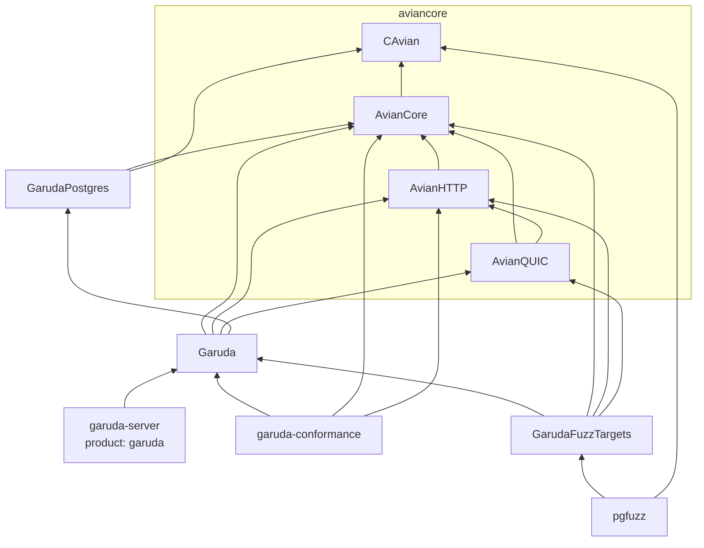
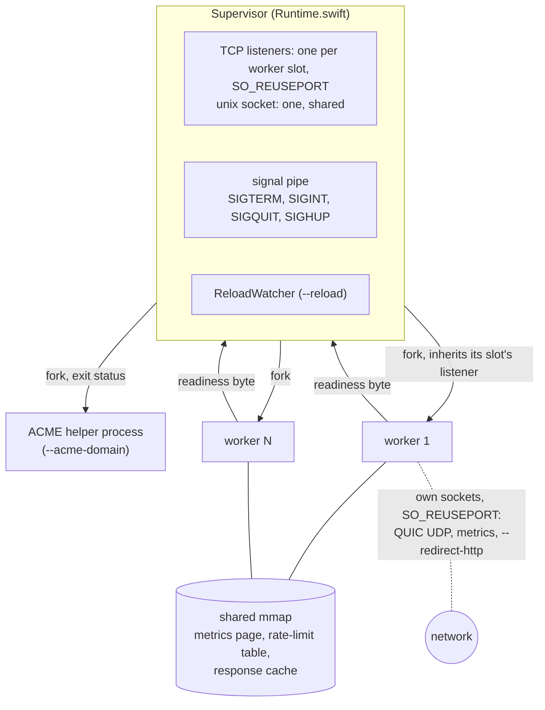
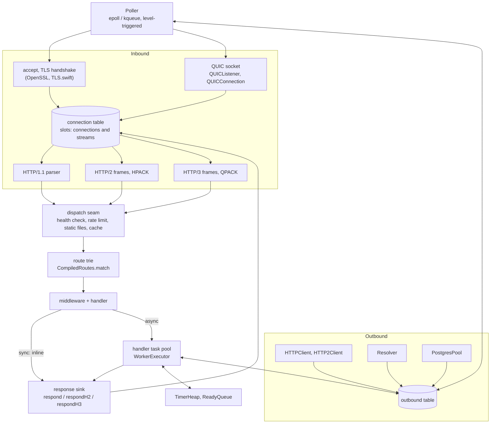
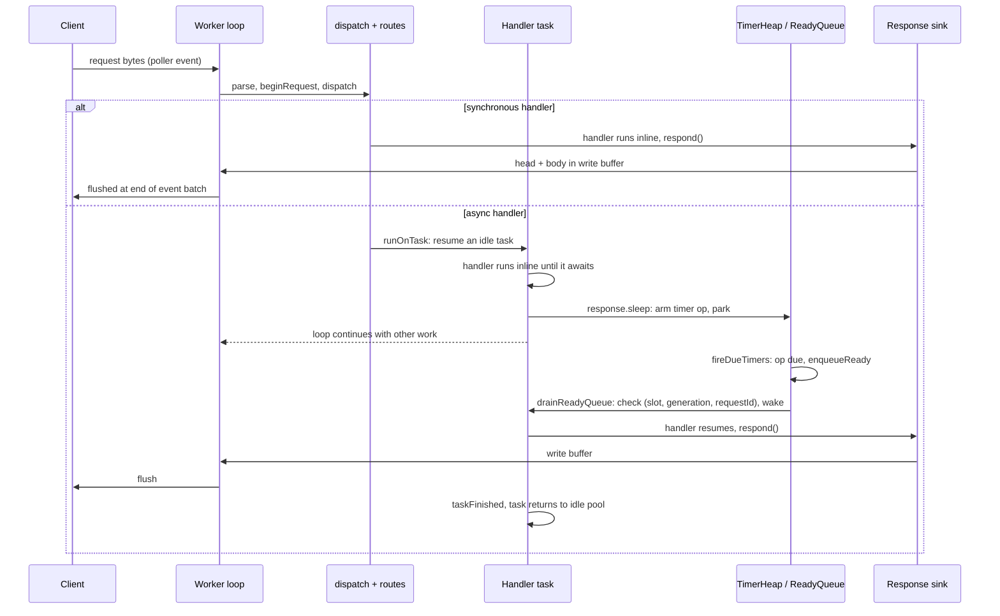

<p align="center">
  
</p>

# Architecture

Garuda is one Swift executable: the `Garuda` library plus the routes an
application registers. A supervisor process owns the listening sockets and
forks worker processes. Each worker is one thread running a readiness poller
over a flat table of connections. The worker parses HTTP/1.1, HTTP/2 and
HTTP/3 itself, runs handlers on that thread, and writes every answer through
one response sink. The binary links OpenSSL, zlib and the Swift runtime.
Foundation is not linked.

Protocol details are in [TRANSPORT.md](TRANSPORT.md), flags in
[CONFIG.md](CONFIG.md), the handler API in [HANDLER-API.md](HANDLER-API.md),
and project status in [README.md](README.md).

---

## Source tree

The protocol and systems layers come from
[aviancore](https://github.com/grepjava/aviancore), a separate package that
other Swift servers share. Garuda depends on it by version; its modules are the
first four rows below. Everything from `GarudaPostgres` down lives in this
repository.

| Target | What it holds |
| --- | --- |
| `CAvian` (aviancore) | C shim: epoll/kqueue, sockets, signals, fork, `sendfile`, TLS over TCP (`avian_tls.c`), crypto primitives for QUIC (`avian_crypto.c`), UDP with `recvmmsg` and GSO (`avian_udp.c`), ACME, compression, and the shared-memory tables for metrics, rate limiting and the response cache |
| `AvianCore` (aviancore) | `ByteBuffer`, `BufferPool`, `Poller`, logging, civil time |
| `AvianHTTP` (aviancore) | HTTP/1.1 parser, chunked decoder, response writer and parser, HPACK, QPACK, HTTP/2 and HTTP/3 framing, WebSocket framing, forwarded-header trust, cache policy |
| `AvianQUIC` (aviancore) | QUIC transport: packets, crypto, loss recovery, streams, the TLS 1.3 handshake |
| `GarudaPostgres` | PostgreSQL wire protocol, session state machines, SCRAM-SHA-256, binary values. No sockets. |
| `Garuda` | Supervisor, worker loop, connection table, HTTP/2 and HTTP/3 servers, dispatch, routes, middleware, response sink, handler tasks, timers, outbound connections, HTTP client, DNS resolver, PostgreSQL pool, streaming responses, WebTransport, static files, reload, ACME, metrics, CLI |
| `garuda-server` | The `garuda` executable: the benchmark routes, served through the handler API |
| `garuda-conformance` | Routes that make engine behaviour observable to the end-to-end suites |
| `GarudaFuzzTargets`, `pgfuzz` | Fuzz targets and their driver ([fuzz/README.md](fuzz/README.md)) |



Swift never imports an OpenSSL header. TLS sessions, contexts and keys are
opaque handles behind functions in the shim.

---

## Processes



### Supervisor

Everything runs under a supervisor, including a single worker
(`GarudaRuntime.runSupervisor`). Before the first fork it:

- opens the listening sockets. TCP gets one socket per worker slot, each with
  `SO_REUSEPORT`, so each worker has its own accept queue. A unix socket is one
  descriptor shared by every worker, because a path binds once;
- maps the shared pages (below);
- compiles the application's routes (`Application.compile`), so every worker
  inherits the same read-only table.

Workers are forked with `av_fork_worker`, which blocks the piped signals across
the fork so none is lost. A child closes every other slot's listener. The
supervisor keeps all listeners open for its whole life. The kernel assigns a
connection to a socket in the `SO_REUSEPORT` group when the SYN arrives, so a
socket that closed would take its queue with it. A replacement worker inherits
the same socket instead.

Each worker opens its own QUIC UDP socket, metrics listener and
`--redirect-http` listener, also with `SO_REUSEPORT`.

After forking, a worker builds its poller, TLS context and listeners, runs the
`app.state` factories and `onWorkerStart` hooks, then writes one byte on its
readiness pipe. The supervisor reads the pipe: one byte means ready, end of
file means the worker died during start-up.

### Shared memory

Three tables are anonymous shared mappings created before the fork:

- **Metrics** (`avian_metrics.c`): two counter slots per worker, cache-line
  aligned. A replacement worker takes the other slot of its pair, so it never
  writes over the worker it replaces.
- **Rate limit** (`avian_ratelimit.c`, `--rate-limit`): GCRA per client
  address, atomic entries, open addressing with a per-server random seed.
- **Response cache** (`avian_cache.c`, `--cache-size`): size-classed slots with
  version words so readers never see a half-written entry. It is flushed on
  every reload. Handler responses are not stored in it yet.

Everything else is per worker: connections, buffers, timers, handler tasks,
outbound connections, the DNS cache, and anything built by `app.state`.

### Reload and signals

A worker that exits on its own is restarted in its slot. `SIGHUP` replaces the
workers one slot at a time:

1. fork the replacement and move the slot to the other metrics slot;
2. wait for its readiness byte, bounded at 60 s. Both workers serve the slot
   meanwhile;
3. send the old worker `SIGQUIT`;
4. when it exits, move to the next slot.

If a replacement dies before it is ready, the slot returns to the old worker
and the pass stops. A reload requested during a pass queues another pass.

`--reload` watches the executable (`ReloadWatcher.swift`) with inotify or
kqueue, and also re-stats it every `--reload-interval`. A change counts once
the file has held still for 300 ms. Forked workers cannot run new code, so the
supervisor re-executes itself (`Reexec.swift`): it waits until no pass,
handover or ACME helper is in flight, checks that the new file runs, and
`exec`s it with the listener descriptors and worker pids in `GARUDA_REEXEC`.
The new image adopts the workers and replaces them as `SIGHUP` would. A change
to a TLS certificate or key starts a replacement pass without an exec.

`--acme-domain` runs the ACME client in a forked helper process, one at a time.
Exit 0 means a new certificate is on disk and starts a replacement pass.
Failures back off from one minute, doubling up to six hours.

Shutdown:

- `SIGTERM`: forwarded to workers. With `--drain-delay`, a worker keeps serving
  but fails `--health-check-path` with 503, then drains.
- `SIGINT`, `SIGQUIT`: drain now. A second one cuts a drain delay short.
- Draining closes keep-alive connections idle between requests (not freshly
  accepted ones that may already hold a request), stops polling and closes the
  listener, and ends the loop once the connection table is empty.
- `--graceful-timeout` bounds in-flight requests. A `SIGALRM` watchdog
  `_exit`s the worker 10 s after that, and the supervisor `SIGKILL`s any worker
  alive past drain delay + grace period + 2 s.

---

## Inside a worker



### The loop

A worker is one `Worker` struct reached through a raw pointer, held in a C
thread-local. `runSynchronousLoop` is:

```swift
while running {
    let n = poller.wait(timeoutMillis: quicPollTimeout(200))
    if n > 0 { processEvents(n) }   // then flush the batch's HTTP/1 responses
    fireDueTimers()                 // TimerHeap -> ReadyQueue
    drainReadyQueue()               // at most 64 resumes
    runHandlerTasks()               // drain the task executor
    quicTick()                      // QUIC timers, at most every 4 ms
    sweepTimeouts()                 // once a second
    if draining && quiescent { running = false }
}
```

The poll timeout is 200 ms, cut to the nearest QUIC or timer deadline (rounded
up), and 0 while the ready queue holds work.

### Connection slots and identity

Connections live in one contiguous slab of `Connection` structs with a free
list (`Connection.swift`). A poller token is `(generation << 24) | slot`.
`allocate` bumps the slot's generation, so an event for a descriptor closed
earlier in the same batch is discarded with one compare. Fixed tokens at the
top of the range name the listener, signal pipe, QUIC socket, metrics and
redirect listeners, and eight pending scrapes. Outbound connections set bit 62.

A slot is a connection or a stream. Each HTTP/2 and HTTP/3 request stream takes
a slot from the same table with `fd = -1` and `parentSlot` pointing at its
connection. An HTTP/3 connection's own slot has no descriptor either. Dispatch,
timers and cancellation treat all of them alike.

A request is identified by `(slot, generation, requestId)`. The generation
changes when the slot is allocated. `requestId` changes at every request on the
slot, so a keep-alive connection's second request is distinct from its first.
Timers, queued resumes, handler tasks and `Response` values all carry this
triple and check it before acting.

States: `readingHead → readingBody → dispatching → writing`, then back to
`readingHead` or closed. Long-lived states are `http2` and `http3`, plus
`closing` for a stream whose response finished before its upload did. A full
table answers 503 and closes. Accepts are bounded at 64 per wake-up, and
`EMFILE` pauses accepting until a slot frees.

### A request, from bytes to response

1. **Read.** `fill` drains the socket into a pooled read buffer. Over TLS it
   keeps reading while OpenSSL holds decrypted bytes the poller cannot see.
2. **Parse.** `HTTPParser.parse` yields offsets into the read buffer and
   allocates nothing. HTTP/2 and HTTP/3 rebuild the head as HTTP/1.1 text in
   the stream slot and run the same parser.
3. **Begin.** `beginRequest` bumps `requestId`, cancels anything left from the
   previous request, decides keep-alive, answers 413 for an oversized
   `Content-Length`, sends `100 Continue` if asked, and sets up body framing.
4. **Body.** The whole body is buffered before dispatch, on every protocol.
   An HTTP/1.1 body is never read past its declared end.
5. **Dispatch** (`Worker.dispatch`): request ID and trace context, then in
   order `--no-websockets` (501 for an upgrade), `--health-check-path`,
   `--rate-limit` (429), `--static-dir`, `--compress` negotiation,
   `--cache-size`, a refusal of any extended CONNECT that is not WebTransport,
   and finally `dispatchRoute`.
6. **Route.** `CompiledRoutes.match` walks a flat byte trie built from the
   patterns: literal before `:param` before trailing `*rest`, with
   backtracking, at most 8 parameters stored as offsets. No match is 404; a
   path another method would match is 405 with `Allow`. A route's deadline, if
   any, is armed here.
7. **Handler.** `runHandler` calls the handler with `Request` and `Response`,
   `~Copyable` views of the slot. Middleware was composed into each route's
   handler at compile time: synchronous middleware up to the first async one
   runs inline, and the rest of the chain and the handler run on a task.
   Typed handlers take extractors (`Path`, `Query`, `Body`, `Form`, `State`
   and others) and return a `ResponseConvertible`.
8. **Sink.** `respond` (`Respond.swift`) runs any `onSend` hooks, then writes
   status, `Date`, `Server`, server headers (Alt-Svc, HSTS, X-Request-ID)
   unless the handler set them, the handler's headers, framing and body. A body
   longer than a declared `Content-Length` is cut to it; a shorter one closes
   the HTTP/1.1 connection or resets the stream. On streams it encodes with
   HPACK or QPACK instead (`respondH2`, `respondH3`).
9. **Write.** A finished HTTP/1 response waits in its write buffer until the
   end of the event batch, or until 16 are queued, and they go out together.
   `finishResponse` then returns the slot to `readingHead` and processes any
   pipelined bytes, or closes it.

A handler that throws gets 500, or the status of a `ResponseError`. One that
returns without answering or waiting gets 500.



### Handler tasks

An async handler does not get a `Task` per request (`HandlerTasks.swift`).
Each worker owns a `WorkerExecutor`, a `TaskExecutor` whose jobs run only on
the worker's thread when the loop drains it, and a pool of long-lived tasks
that prefer it. A request resumes an idle task, which runs the handler inline
in the same loop turn until it answers or awaits. When all tasks are busy a new
one is started, up to 1,024 or the connection capacity, whichever is lower.
Past that the request waits in the pool's queue. The pool is created on the
first async request. `HandlerTaskTests` checks that a warm async request
allocates nothing on glibc.

To the rest of the engine, a request on a task is a continuation of kind
`.task`. Waits on the engine (`Response.sleep`, a streamed body's write) park
the task with an `UnsafeContinuation` and resume it through the ready queue or
the executor, never inline from the code that made room.

### Timers and continuations

`AsyncOps.swift` holds three fixed-capacity structures, sized to the
connection table:

- **`AsyncOpPool`**: op records with a free list. Each stores slot,
  `requestId`, kind (`timer`, `deadline`, `outbound`, `timedWait`), a
  microsecond deadline and its heap index. Allocation bumps a generation.
- **`TimerHeap`**: a min-heap of `(deadlineUs, opIndex, opGeneration)`. Ops can
  be removed from the middle. Deadlines use the monotonic microsecond clock
  plus one, so a timer never fires early.
- **`ReadyQueue`**: a ring buffer of `(slot, generation, requestId, ticket)`.
  The ticket is a per-worker serial stamped on the connection when it becomes
  ready, so only the newest entry can resume it. Stale entries are skipped at
  drain time, and a full queue is compacted in place.

A connection holds at most one continuation op (`contOp`) and one route
deadline op (`deadlineOp`). A synchronous handler can wait with
`Response.after(milliseconds:then:)`, which parks a handler closure on the
slot.

A route deadline (`app.deadline`) fires as a separate op. It answers 504, marks
the request `.timedOut` so later sends from the handler are dropped, and
cancels the task. It bounds waiting, not computing: nothing preempts a handler
that loops without awaiting.

### Cancellation

`cancelOps` frees the op named by `contOp`, unlinks it from the heap, drops a
parked handler closure, cancels the request's task (or its place in the task
queue), and ends a streamed-body writer's wait. It runs at every request start,
on keep-alive completion, and from `closeConnection`. An HTTP/2 `RST_STREAM`,
an HTTP/3 `RESET_STREAM` or `STOP_SENDING`, and a parent connection closing
all reach `closeConnection`. A cancelled task's wait throws
`HandlerWaitError.cancelled`, the handler unwinds, and the task returns to the
pool.

A handler waiting on something other than the engine, such as an outbound
socket, is not unwound when its request ends. Those waits have their own
timeouts. When it resumes, every `Response` operation checks
`(slot, generation, requestId)` and drops an answer for a request that is gone.
`response.isCancelled` lets a handler check for itself.

### Outbound I/O

Connections a worker makes (`Outbound.swift`) are registered on the same
poller and served on the same thread. They live in their own slab (256 per
worker), not the connection table, so an idle pooled connection does not stop
a draining worker from looking quiescent. They are closed when the worker
tears down. Idle connections are pooled per destination (8 per key, 30 s) and
watched for readability, so a peer hang-up is noticed before reuse. A connect
is bounded by an `outbound` timer op. A socket has one waiter, parked as a
continuation and resumed from the poller event.

Built on it:

- **HTTP client** (`HTTPClient.swift`, `HTTP2Client.swift`): HTTP/1.1 and
  HTTP/2, chosen by ALPN. HTTP/2 connections are shared by every request to the
  same place; the request waiting for data holds a read baton. Redirects are
  not followed. Pooled TLS connections are keyed by host name, trust store and
  ALPN offer.
- **DNS** (`Resolver.swift`): a stub resolver over UDP on the poller, using
  `/etc/resolv.conf` read once at start-up, retrying over TCP when an answer is
  truncated. `getaddrinfo` is never called. Answers, including negative ones,
  are cached per worker.
- **PostgreSQL** (`Postgres.swift`, `PostgresPool.swift`, `GarudaPostgres`):
  a pool per worker, built by `app.state` after the fork. TLS required by
  default, SCRAM-SHA-256, parameters bound separately from SQL, a per-connection
  prepared-statement cache, binary results for common types on repeated
  statements, and transactions. `TimedWait.swift` bounds a wait for a pooled
  connection.

---

## Keeping allocation off the request path

- Connections are slab entries reached by pointer, not objects.
- `ByteBuffer` is a pointer and three integers with an explicit `destroy()`.
  Read buffers come from a LIFO `BufferPool`.
- The parser yields offsets. Routes match bytes. Header values, parameters and
  the body reach a handler as byte spans unless it asks for a `String`.
- Request headers live in one worker-wide table. A request whose table was
  overwritten by another request's parse has its head parsed again from bytes
  that stay in place, never copied.
- `setInterest` skips `epoll_ctl` when the mask is unchanged.
- `accept4`, `TCP_NODELAY`, `sendfile` for static files (`SSL_sendfile` under
  `--ktls`), `recvmmsg` and UDP GSO for QUIC.

Classes are used where the cost is per process or per connection:
`H2Connection`, `H3Connection`, `QUICConnection`, `QUICListener`, the handler
task pool, the supervisor's state.

## Limits

- `--max-header-size`, a header count limit, and `--max-body` counted
  cumulatively on every protocol. `--max-connections` per worker.
- A write buffer that grew past four read-buffer sizes is freed once drained.
- A stream moves bytes to its connection only while the connection's write
  buffer is under the write high-water mark (512 KiB). A streamed response
  waits above that mark and resumes at the low-water mark (128 KiB).
- `sweepTimeouts` enforces `--keep-alive` on idle connections and
  `--request-timeout` on a head, body, write or streamed response that stopped
  moving. HTTP/2 connections time out only when they have no streams. QUIC uses
  its negotiated idle timeout.

## Not wired to handlers yet

- **WebSocket**: framing, UTF-8 validation and permessage-deflate exist in
  `AvianHTTP` with unit tests. There is no handshake path; `WebSocket.swift`
  holds stubs.
- **Response compression and the response cache** do not apply to handler
  responses. Pre-compressed static files (`--compress-static`) are served.

## Testing

- `swift test`: parser, HPACK, QUIC packet protection and streams, route
  table, middleware, extraction, JSON, async ops, handler tasks (including the
  allocation count), deadlines, streaming responses, response hooks, outbound
  connections, HTTP client, DNS, PostgreSQL wire and session (plus integration
  tests against a server), and the fuzz corpus. Handlers are driven through
  `TestClient`, which adopts one end of a socket pair into a worker's table.
- `scripts/`: end-to-end suites against independent clients, including
  `http2-test.py` (`h2`), `http3-test.py` and `webtransport-test.py`
  (`aioquic`), `router-streams-test.py`, `handler-test.py` (against
  `garuda-conformance`), `feature-test.py`, and shell scripts for ACME, static
  files, rate limiting, redirects, SNI, draining and reload.
- `pgfuzz`: see [fuzz/README.md](fuzz/README.md).
